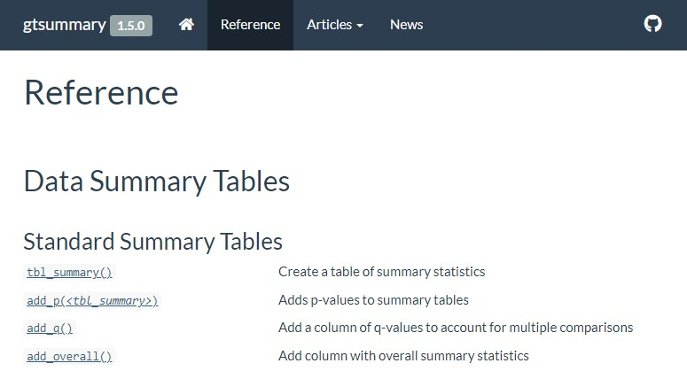

```{r setup, include=FALSE, warning=FALSE}
knitr::opts_chunk$set(echo = TRUE, warning = FALSE)

set.seed(78987)
library(xaringanthemer)
library(gtsummary)

style_mono_accent(
  base_color = "#003B5C"
)

# xaringan::inf_mr() 
options(htmltools.dir.version = FALSE) 

# helper function to save gtsummary objects
my_gtsave <- function(x) {
  # if being knitted, then skip (save your objects before you knit)
  if (isTRUE(getOption('knitr.in.progress'))) return(invisible(NULL))
   
  path <- file.path("Images", paste0(x, ".png"))
  x <- eval(parse(text=x)) 
  if (inherits(x, "gtsummary")) x <- as_gt(x) 
  gt::gtsave(x, path)   
}    
```

```{r xaringanExtra-freezeframe, echo=FALSE}
xaringanExtra::use_freezeframe()
```

class: inverse, center, title-slide, middle

# R Package Websites with {pkgdown}

### (The Briefest Introduction)

### Daniel D. Sjoberg

#### November 16, 2021

<p align="center"></p>

.medium[
`r icons::fontawesome("twitter") %>% icons::icon_style(fill = "#FFFFFF")` @statistishdan
`r icons::fontawesome("github")  %>% icons::icon_style(fill = "#FFFFFF")` @ddsjoberg
]

---
# {pkgdown} minimalism

.pull-left[
```r
> usethis::use_pkgdown()
√ Setting active project to '~/new.pkg'
√ Adding '^_pkgdown\\.yml$', '^docs$', 
    '^pkgdown$' to '.Rbuildignore'
√ Adding 'docs' to '.gitignore'
√ Writing '_pkgdown.yml'
* Modify '_pkgdown.yml'
```
]

--

.pull-right[
File `_pkgdown.yml`
```
url: ~
```
]

---
# Customize `_pkgdown.yml`

.pull-left[
```
url: http://www.danieldsjoberg.com/gtsummary/

template:
  params:
    bootswatch: flatly

authors:
  Daniel D. Sjoberg:
    href: "http://www.danieldsjoberg.com/"
```
]

--

.pull-right[.large[
- Set the URL

- Pick a bootswatch 3 theme
  - Browse themes https://gallery.shinyapps.io/117-shinythemes/

- Add links to your personal website
]]

--

<p align="center">
Bootstrap 5 Support Coming Soon in {pkgdown} 2.0.0
<br>

</p>

---
# Customize `_pkgdown.yml`

.pull-left[
```
navbar:
  type: default
  left:
  - icon: fa-home
    href: index.html
  - text: Reference
    href: reference/index.html
  - text: News
    href: news/index.html
  right:
  - icon: fa-github fa-lg
    href: https://github.com/ddsjoberg/gtsummary 
    
reference:
  - title: Data Summary Tables
  - subtitle: Standard Summary Tables
  - contents:
      - tbl_summary
      - add_p.tbl_summary
```
]

--

.pull-right[
<p align="center"></p>
]

???

Contents will be populated with `README` if it exists.

We'll come back to `_pkgdown.yml` later for customization...

---
# Where to build site from?

<p align="center"></p>

---
# Utilize GitHub Actions

.large[
- Use GitHub Actions to build your site for you

- Deploy the site from the `gh-pages` branch

- `use_pkgdown_github_pages()`

  - Calls `use_pkgdown()`

  - `use_github_pages()` prepares to publish the pkgdown site from the `gh-pages` branch

  - `use_github_action("pkgdown")` configures a GitHub Action to automatically build the pkgdown site and deploy it via GitHub Pages

  - The pkgdown site's URL is added to the pkgdown configuration file, to the URL field of `DESCRIPTION`, and to the GitHub repo.
]


---
# Take-home Message

.pull-left[.xxlarge[
- Find a {pkgdown} website you like and copy the `_pkgdown.yml` file

- Use the defaults without customizing the `_pkgdown.yml` file...that is great too!
]]

.pull-right[
<p align="center"></p>
]
